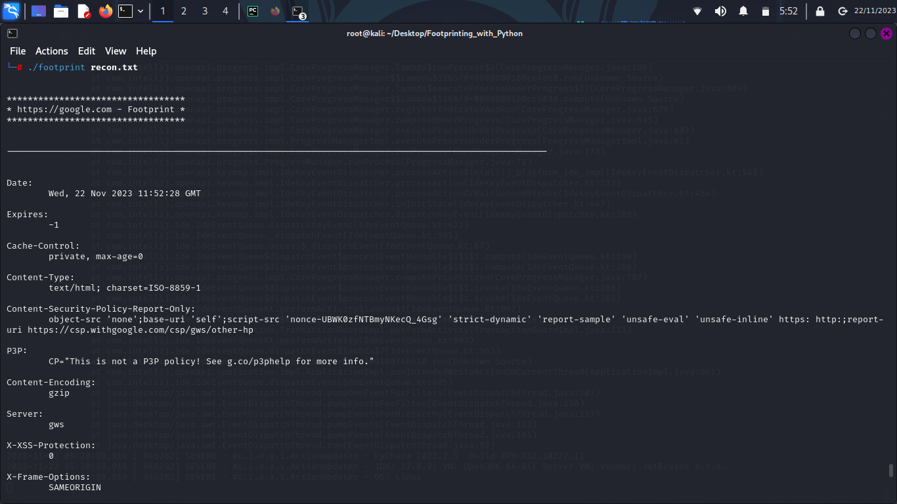
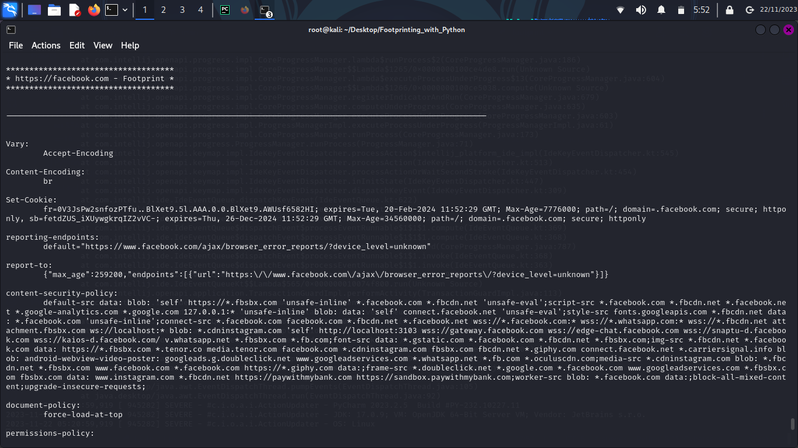
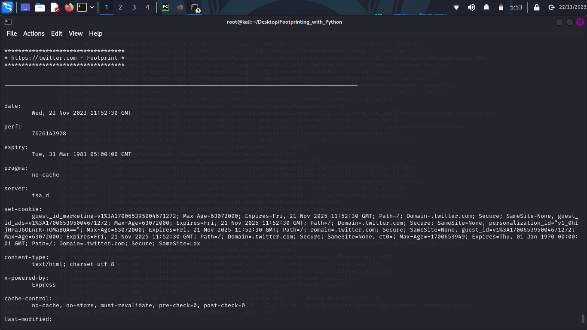
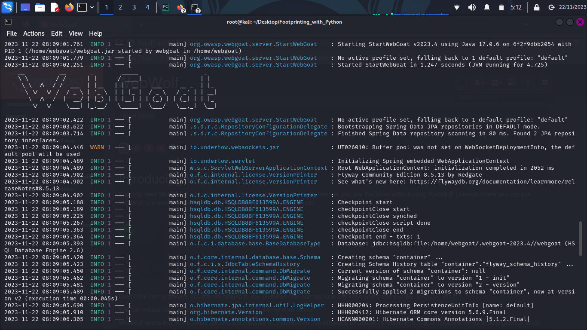
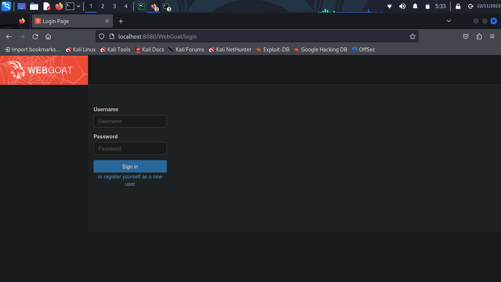
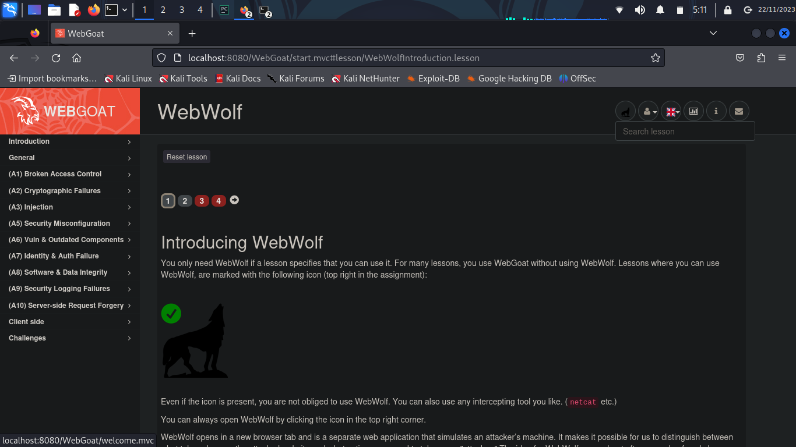
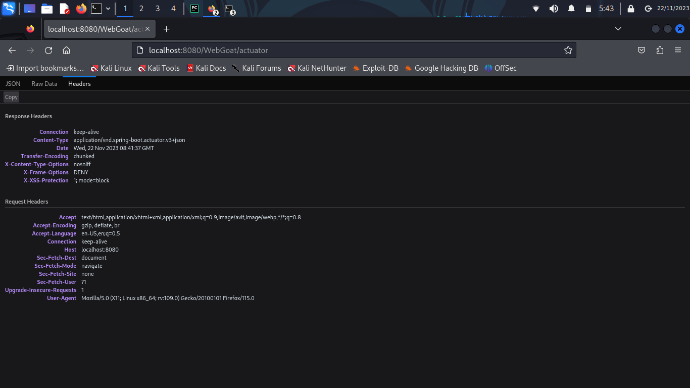
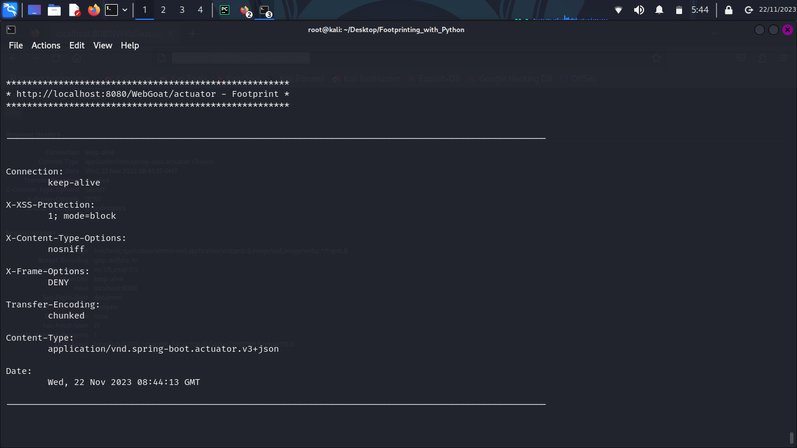

# Footprinting with Python  

---

This is a tool used for footprinting web applications by retrieving the application's headers.  

This project is also a skill showcase. For this showcase, the [tool][link1] was used to footprint an application running
within a **Docker** container. The image used was a [OWASP WebGoat][link2] container running on [Docker][link3].  

The concept for this project was based on the [Coursera Guided Project][link4]. Although, the source code present here
was created, debugged, and tested by the owner of this repository.  

#### For the tool's functionality, you can click here: [Tool][link5]  

#### For the skill showcase, you can click here: [Showcase][link6]  

---  

### **How to use the tool**  

The tool was designed to be used on linux's terminal.  

You can use it by downloading source code on [footprint][code],
which can be run from anywhere by adding the file to the `/bin` folder.  

Otherwise, you can download the Python 3 source
code on [footprint.py][pycode], using this code you'll need to execute the command `python3 ./footprint.py [args]`.  

Alternatively, you can clone this repository by executing the following command:  

> `git clone https://github.com/ItaloHugoMDS/Footprinting_with_Python.git`  

---  

### **Syntax**  

The tool requires a few arguments to be run successfully.  

You can either specify a single URL while executing the script. For example:  

> `./footprint "https://google.com"`  

If you are using the Python 3 script:  

> `python3 footprint.py "https://google.com"`  

However, the tool also accepts multiple URLs at once. To run the script through multiple URLs, you should create a file
listing them. You can see an example of such a file under [recon.txt][file].  

After creating a file with the URLs, just like in [recon.txt][file], you can execute the following command:  

> `./footprint [URL_list.txt]`  

In case you use the Python 3 script, you can run:  

> `python3 footprint.py [URL_list.txt]`  

To run the code using the ".txt" file from this repository, you can run:  

> `./footprint recon.txt`  

Using the Python 3 script:  

> `python3 footprint recon.txt`  

The output will look similar to this:  

> [][image1]  

> [][image2]  

> [][image3]  

---  

## Showcase  

For this showcase, a **Docker** container running a version of **WebGoat** was started to be footprinted by the tool.
To further understanding of how to run the application check out [WebGoat GitHub][link2].  

Running web application:  

> [][image4]  

> [][image5]  

> [][image6]  

A specific endpoint from the application was footprinted by the tool.  

The application's endpoint:  

> [][image7]  

The footprint done by the tool:  

> [][image8]  

The result returned by the tool only had little information. But the footprint was successfully executed.  

[link1]: https://github.com/ItaloHugoMDS/Footprinting_with_Python "Footprinting tool"
[link2]: https://github.com/WebGoat/WebGoat "WebGoat"
[link3]: https://www.docker.com/ "Docker"
[link4]: https://www.coursera.org/projects/write-your-own-python-tool-to-footprint-a-web-application "Project source"
[link5]: https://github.com/ItaloHugoMDS/Footprinting_with_Python#how-to-use-the-tool "Tool's functionality"
[link6]: https://github.com/ItaloHugoMDS/Footprinting_with_Python#showcase "Skill showcase"
[code]: https://github.com/ItaloHugoMDS/Footprinting_with_Python/blob/main/footprint "Source code"
[pycode]: https://github.com/ItaloHugoMDS/Footprinting_with_Python/blob/main/footprint.py "Souce '.py' code"
[file]: https://github.com/ItaloHugoMDS/Footprinting_with_Python/blob/main/recon.txt "File example"
[image1]: https://github.com/ItaloHugoMDS/Footprinting_with_Python/blob/main/images/Footprinting_File_1.png
[image2]: https://github.com/ItaloHugoMDS/Footprinting_with_Python/blob/main/images/Footprinting_File_2.png
[image3]: https://github.com/ItaloHugoMDS/Footprinting_with_Python/blob/main/images/Footprinting_File_3.png
[image4]: https://github.com/ItaloHugoMDS/Footprinting_with_Python/blob/main/images/OWASP_WebGoat_Terminal_Execution.png
[image5]: https://github.com/ItaloHugoMDS/Footprinting_with_Python/blob/main/images/OWASP_WebGoat_Login_Page.png
[image6]: https://github.com/ItaloHugoMDS/Footprinting_with_Python/blob/main/images/OWASP_WebGoat_Running_Page.png
[image7]: https://github.com/ItaloHugoMDS/Footprinting_with_Python/blob/main/images/Web_Application_Page.png
[image8]: https://github.com/ItaloHugoMDS/Footprinting_with_Python/blob/main/images/Web_Application_Footprint.png
